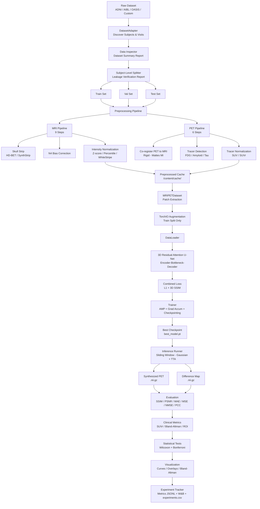
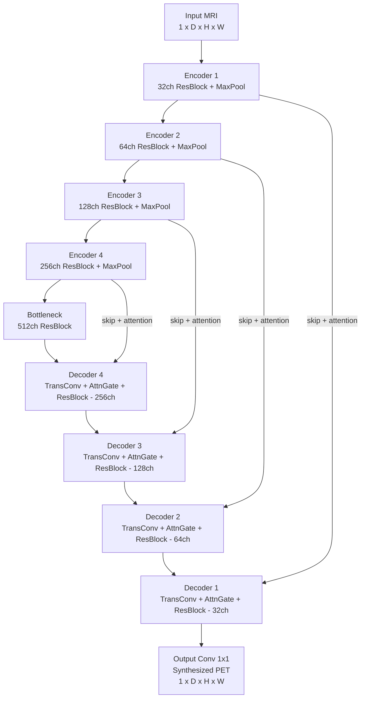

# Pipeline Architecture

## Overview

```mermaid
flowchart TD
    A[Raw Dataset\nADNI / AIBL / OASIS / Custom] --> B[DatasetAdapter\nDiscover Subjects & Visits]
    B --> C[Data Inspector\nDataset Summary Report]
    C --> D[Subject-Level Splitter\nLeakage Verification Report]
    D --> E1[Train Set]
    D --> E2[Val Set]
    D --> E3[Test Set]

    E1 --> F[Preprocessing Pipeline]
    E2 --> F
    E3 --> F

    F --> G1[MRI Pipeline\n9 Steps]
    F --> G2[PET Pipeline\n6 Steps]

    G1 --> H1[Skull Strip\nHD-BET / SynthStrip]
    G1 --> H2[N4 Bias Correction]
    G1 --> H3[Intensity Normalization\nZ-score / Percentile / WhiteStripe]

    G2 --> I1[Co-register PET to MRI\nRigid - Mattes MI]
    G2 --> I2[Tracer Detection\nFDG / Amyloid / Tau]
    G2 --> I3[Tracer Normalization\nSUV / SUVr]

    H3 --> J[Preprocessed Cache\n/content/cache/]
    I3 --> J

    J --> K[MRIPETDataset\nPatch Extraction]
    K --> L[TorchIO Augmentation\nTrain Split Only]
    L --> M[DataLoader]

    M --> N[3D Residual Attention U-Net\nEncoder-Bottleneck-Decoder]
    N --> O[Combined Loss\nL1 + 3D SSIM]
    O --> P[Trainer\nAMP + Grad Accum + Checkpointing]
    P --> Q[Best Checkpoint\nbest_model.pt]

    Q --> R[Inference Runner\nSliding Window - Gaussian + TTA]
    R --> S1[Synthesized PET\n.nii.gz]
    R --> S2[Difference Map\n.nii.gz]

    S1 --> T[Evaluation\nSSIM / PSNR / MAE / MSE / NMSE / PCC]
    S2 --> T
    T --> U[Clinical Metrics\nSUVr / Bland-Altman / ROI]
    U --> V[Statistical Tests\nWilcoxon + Bonferroni]
    V --> W[Visualization\nCurves / Overlays / Bland-Altman]
    W --> X[Experiment Tracker\nMetrics JSONL + W&B + experiments.csv]
```

## Model Architecture — 3D Residual Attention U-Net

```mermaid
flowchart TD
    IN[Input MRI\n1 x D x H x W]

    IN --> E1[Encoder 1\n32ch ResBlock + MaxPool]
    E1 --> E2[Encoder 2\n64ch ResBlock + MaxPool]
    E2 --> E3[Encoder 3\n128ch ResBlock + MaxPool]
    E3 --> E4[Encoder 4\n256ch ResBlock + MaxPool]
    E4 --> BN[Bottleneck\n512ch ResBlock]

    BN --> D4[Decoder 4\nTransConv + AttnGate + ResBlock - 256ch]
    D4 --> D3[Decoder 3\nTransConv + AttnGate + ResBlock - 128ch]
    D3 --> D2[Decoder 2\nTransConv + AttnGate + ResBlock - 64ch]
    D2 --> D1[Decoder 1\nTransConv + AttnGate + ResBlock - 32ch]

    E1 --skip + attention--> D1
    E2 --skip + attention--> D2
    E3 --skip + attention--> D3
    E4 --skip + attention--> D4

    D1 --> OUT[Output Conv 1x1\nSynthesized PET\n1 x D x H x W]
```
